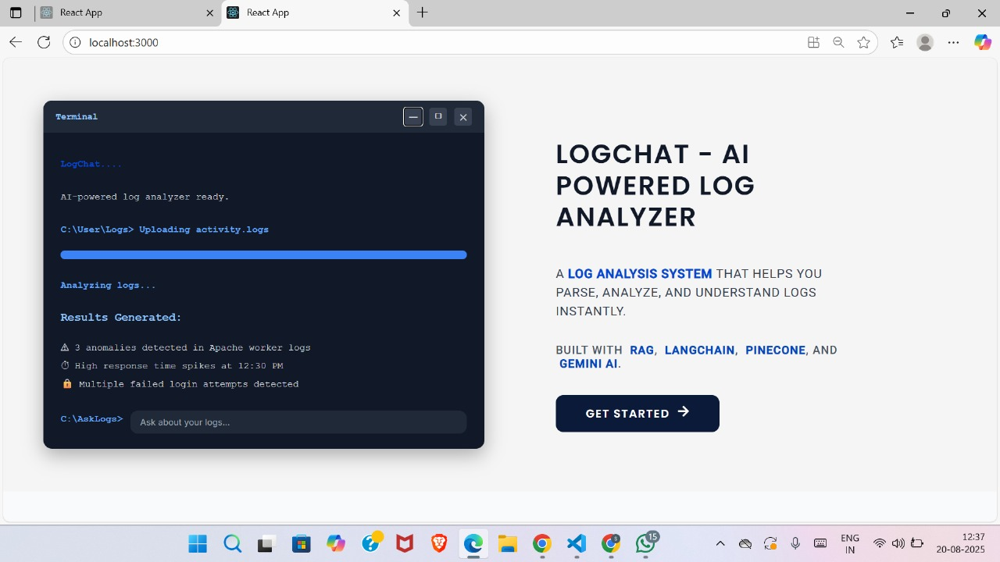
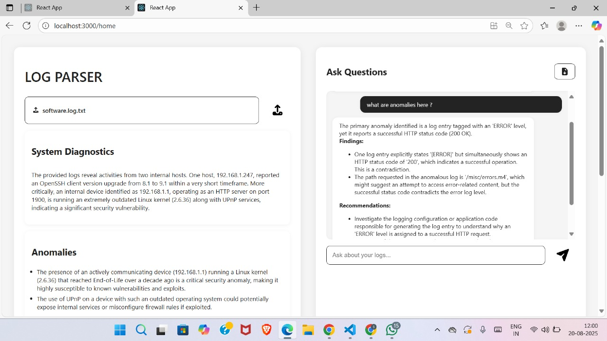

## LogChat

**LogChat** is a multi-format log parser with automated anomaly detection and AI-driven explanations with **RAG (Retrieval-Augmented Generation)** capabilities.  
It helps developers and DevOps engineers parse, analyze, and intelligently query application logs.  

The system uses **Flask (Python)** for the backend and **React** for the frontend, integrated with:  
- **LangChain** for building RAG pipelines  
- **Pinecone** as a vector database for log embeddings  
- **Gemini LLM** for natural language understanding & responses  

---

## ✨ Features

- 🔍 **Multi-format Log Parsing** – Uses **Drain3** to structure unstructured logs.  
- 📊 **Interactive Dashboard** – Frontend in **React** for insights.  
- 🤖 **RAG-powered Log Querying** – Combines **LangChain + Pinecone + Gemini LLM** for semantic log search and contextual answers.  
- 📂 **Semantic Search** – Store and retrieve logs using embeddings.  
- ⚡ **Fast & Lightweight API** – Backend built with **Flask**.  
- 🔐 **Secure Environment** – API keys and server configs stored in `.env`.  

---

## 🛠️ Tech Stack

**Frontend:** React, Axios, TailwindCSS (if used)  
**Backend:** Flask (Python)  
**Vector Store:** Pinecone  
**AI Model:** Gemini (Google Generative AI)  
**Framework:** LangChain (for RAG pipeline)  
**Log Parsing:** Drain3  

---

## ⚙️ Setup & Installation

### 1. Clone the Repository
```bash
git clone https://github.com/shrutiikadam/LOGCHAT.git
cd logchat
``` 
2. Backend Setup (Flask + LangChain)
```bash
cd backend
python -m venv venv
source venv/bin/activate   # On Windows: venv\Scripts\activate
pip install -r requirements.txt

Create a .env file in the backend directory:
GEMINI_API_KEY=your_gemini_api_key
GEMINI_CHAT_MODEL=_your_gemini_model
GEMINI_EMBED_MODEL=text-embedding-004   # <- required by you
# Pinecone
PINECONE_API_KEY=pinecone_api_key
PINECONE_INDEX=logchat-index            # will be created if missing
PINECONE_CLOUD=aws                      # or gcp (for serverless create)
PINECONE_REGION=us-east-1               # pick closest region
```

Run the backend:
```bash
python app.py
```
3. Frontend Setup (React)
```bash
cd frontend
npm install
npm start
```

## 📊 Workflow

1. 📝 Logs are **uploaded** and **parsed with Drain3** into structured and reduced format.  
2. 🤖 The **structured logs** are passed to **Gemini LLM** for:  
   - Insights  
   - Summaries  
   - Recommendations  
   - Threat level analysis  
3. 📂 Gemini returns a **JSON response**, which (along with the parsed logs) is stored in **Pinecone**.  
4. 🔍 On a query, **LangChain** retrieves the most relevant log chunks + Gemini insights from Pinecone.  
5. 🤖 **Gemini LLM** processes the retrieved context and generates an intelligent response using **RAG**.  
6. 📊 Final results are **sent to the React frontend dashboard** for visualization.  

## 🏗️ Demo

##  Home Page

##  Main Page
